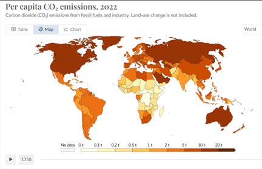
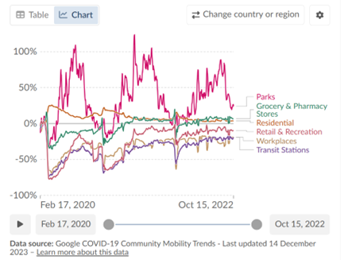
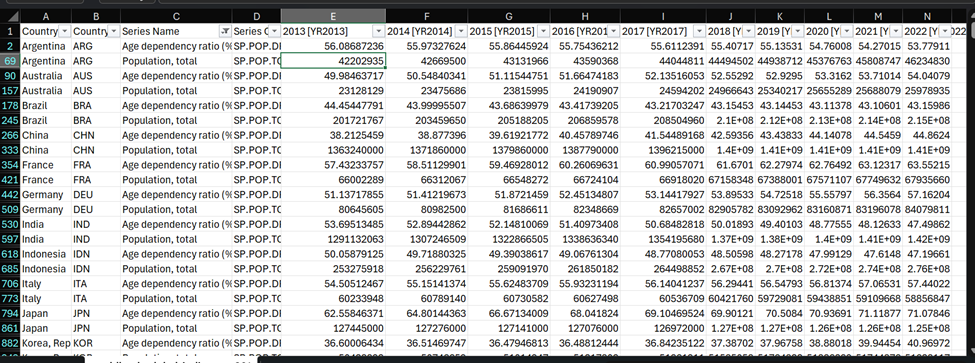
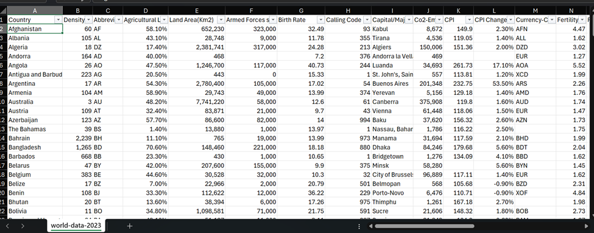

# Project 3 Proposal

Project Title: World Data Indicators 2013 - 2023
Start Date: 12/18/2023
Team: Alyssa Cullinan, Shubhangi Bidkar, Sonia Singh

Repo: https://github.com/AlyssaCullinan/project3-world-indicators.git
Technologies: PostgreSQL, Python (SQLAlchemy, Flask), HTML/CSS, JavaScript (D3, Leaflet, Plotly)

### Overview

We are analyzing economic, environmental, technological infrastructure, poverty, health, and financial data from two datasets which were downloaded to csv files. We would like to analyze different world indicator trends and perform a statistical analysis on them. 

### Data Sources
* World Bank World Development Indicators (2012-2022) 
https://databank.worldbank.org/source/world-development-indicators

* Global Country Information Dataset (2023)
https://www.kaggle.com/datasets/nelgiriyewithana/countries-of-the-world-2023/

### Examples of Possible Visualizations

### Examples of the Dataset

