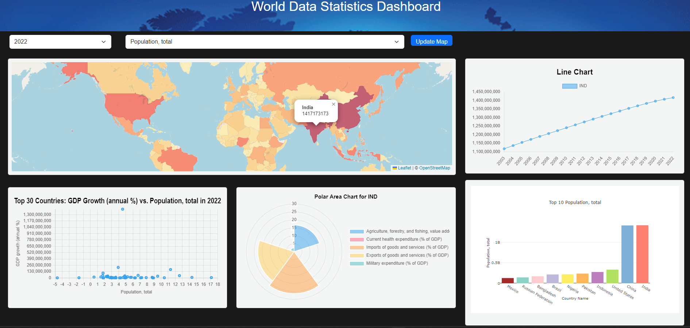

## Description
We created an interactive dashboard to explore data from the official World Bank website. We were interested in telling a story through our visualization dashboard to show various attributes within a single webpage.

Our world has gone through drastic changes especially in the past few years with the pandemic, war, rising inflation, and population trends. We were interested in seeing the global data visualized over the past 20 years.

## Table of Contents 

- [Features](#Features)
- [Dashboard](#Dashboard)
- [Folder Structure](#Folder-Structure)
- [Dashboard Workflow](#Dashboard-Workflow)
- [Built With](#Built-With)
- [Running the Application](#Running-the-Application)
- [Data Sources](#Data-Sources)
- [Credits](#Credits)

## Features
 * Two dropdown menus allow users to select the year and indicator name which updates the map and charts.
 
* Choropleth map
    * When users hover over a country on the map, the line chart and polar area chart update with data for that country.
* Line chart 
    * Updates when users hover over a country on the map. Displays time series data for the  selected country and indicator.
* Bar chart
    * Displays the top ten countries for the selected indicator and year. 
* Scatter plot
    * Updates based on year and indicator selected from the dropdown.
    * Has a fixed Y axis variable GDP Growth (annual %).
* Polar Area chart
    * Updates when users hover over a country on the map. Displays for indicators with "% of GDP" data for that country.

## Dashboard

## Folder Structure

* docs
* python
    * data_cleaning.ipynb
    * config.py
* static
    * css
        * styles.css
    * data
        * final_data.csv
    * images
    * js
        * bar_chart.js
        * leaflet-heat.js
        * line_chart.js
        * main.js
        * map.js
        * polarArea_chart.js
        * scatter_plot.js
* templates
    * index.html
* app.py

## Dashboard Workflow

## Built With

*	Python 
*	jupyter notebook 
*	conda 
*	PostgreSQL
*	flask
*	html
*	javascript
*	SQLAlchemy
*	D3 library https://d3js.org/d3.v7.min.js
*	Plotly https://cdn.plot.ly/plotly-latest.min.js
*	Leaflet library https://unpkg.com/leaflet@1.9.4/dist/leaflet.js
*	Chart.js https://www.chartjs.org/
*	Python Modules
    *	pandas 

## Running The Application
* Copy the repo and clone it onto your machine.
* Create a postgres database on your local machine. Use the schema.sql file to create the table structure.
* Create a config.py and enter your postgres username, password, database name, and connection port. 
* Run the app.py file

## Data Sources
* World Bank World Development Indicators (2003-2022) 

    https://databank.worldbank.org/source/world-development-indicators
 * Country Polygons as GeoJSON

    https://datahub.io/core/geo-countries
       

## Credits
Team: Alyssa Cullinan, Shubhangi Bidkar
